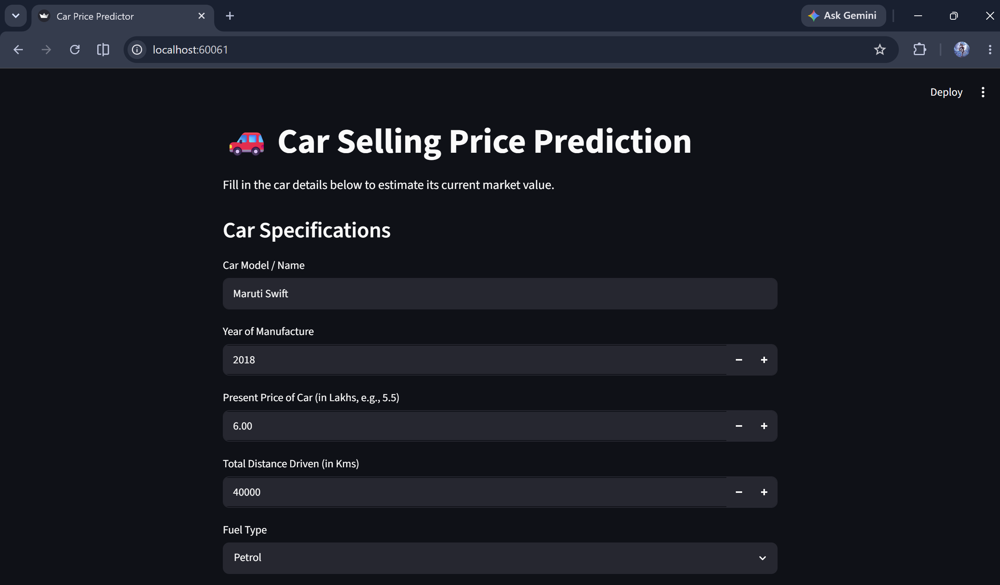

# Car Sales Price Predictor

A production-ready Machine Learning pipeline that predicts automobile sales prices using Linear Regression. This repository features a decoupled architecture with a high-performance backend API and an interactive frontend UI, completely containerized using Docker.

---
## 🖥️ Interface Preview



---

## 📊 Model Performance

The underlying regression model evaluates performance metrics in **Lakhs (INR)**:

* **Algorithm:** Linear Regression
* **Model $R^2$ Score on Test Set:** 84.898%
* **Mean Absolute Error (MAE):** 1.22 Lakhs
* **Root Mean Squared Error (RMSE):** 1.87 Lakhs

All trained model weights, scalers, and production artifacts are serialized and versioned automatically upon running the training script.

---

## 🏗️ Architecture Overview

The application is split into two isolated layers to maintain a clean separation of concerns:
1.  **Backend API (FastAPI):** Exposes the machine learning model via a REST API endpoint for inference, serving predictive requests on port `8000`.
2.  **Frontend Interface (Streamlit):** Provides an intuitive web UI for end-users to input car configurations and visualize price predictions, running on port `8501`.

---

## 🚀 Getting Started

### Prerequisites
* Docker Desktop installed and running
* Git

### Running via Docker (Recommended)

To run the entire ecosystem without worrying about local Python dependency mismatches, use the pre-configured Docker container:

1. **Build the Docker Image:**
   ```bash
   docker build -t car-price-predictor .
Run the Container with Port Forwarding:

Bash
docker run -p 60060:8000 -p 60061:8501 car-price-predictor
Access the Applications:

Streamlit Web UI: Open http://localhost:60061 in your browser.

FastAPI Documentation (Swagger UI): Open http://localhost:60060/docs.

Local Development Setup
If you prefer to run or debug the scripts natively:

Create and Activate a Virtual Environment:
python -h venv .venv
./.venv/Scripts/Activate.ps1

Install Dependencies:
pip install -r requirements.txt

Train the Model:
python main.py

Launch the UI:
streamlit run streamlit_app.py